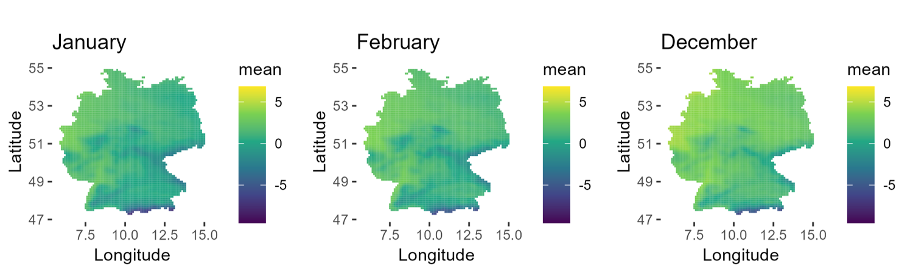

# MCERA5 

> Download, analyze, and visualize ERA5 climate reanalysis data directly in R.

[](https://opensource.org/licenses/MIT)
[](https://github.com/marlenebauer/MCERA5/stargazers)

---

## Overview

**MCERA5** is an R package that simplifies access to the [ERA5 reanalysis dataset](https://www.ecmwf.int/en/forecasts/dataset/ecmwf-reanalysis-v5) family from the European Centre for Medium-Range Weather Forecasts (ECMWF). It wraps the [`ecmwfr`](https://github.com/bluegreen-labs/ecmwfr) package to interface with the ECMWF API and retrieve data from the [Copernicus Climate Data Store (CDS)](https://cds.climate.copernicus.eu/).

**Key capabilities:**

- Simple, user-friendly interface for ERA5 data access
- Flexible downloads by time period, variable, season, and geographic area
- Time-series statistics (mean, median, min/max, Sen Slope, Mann-Kendall)
- Built-in visualization of spatial and temporal results

---

## Installation

`MCERA5` is not yet on CRAN. Install the development version from GitHub:

```r
# Install remotes if needed
install.packages("remotes")

remotes::install_github("marlenebauer/MCERA5")
```

**Required:** A CDS user ID and API key — register and find yours at your [CDS profile](https://cds.climate.copernicus.eu/user/login).

**Recommended:** Install `rgeoboundaries` for country-level spatial filtering:

```r
remotes::install_github("wmgeolab/rgeoboundaries")
library(rgeoboundaries)
```

---

## Quick Start

```r
library(MCERA5)

# Credentials
user <- "your_user_id"
key  <- "your_api_key"

# Download ERA5-Land monthly mean 2m temperature for Germany (DJF winters, 2009–2020)
data <- get_era5(
  user              = user,
  key               = key,
  dataset_short_name = "reanalysis-era5-land-monthly-means",
  variable          = "2m_temperature",
  StartDate         = "2009-12-01",
  EndDate           = "2020-02-29",
  time              = sprintf("%02d:00", 4:5),   # 04:00 and 05:00 UTC
  season            = "DJF",
  country_name      = "Germany",
  product_type      = "monthly_averaged_reanalysis"
)
```

---

## Analysis & Visualization

Compute monthly statistics over the downloaded dataset:

```r
# Calculate mean, median, min, max, Sen Slope, Mann-Kendall τ and p-value
result <- raster_analysis(data)

# Plot monthly mean temperature
monthly_plots(result, stat = "mean", output = "mean_months.png")
```



*Monthly mean 2m temperature over Germany for DJF winters (2009–2020).*

---

## Function Reference

| Function | Description |
|---|---|
| `get_era5()` | Download ERA5 data for a given variable, period, and area |
| `raster_analysis()` | Compute monthly statistics (mean, median, Sen Slope, Mann-Kendall, …) |
| `monthly_plots()` | Visualize monthly statistics as raster maps |

For full parameter details, see the package documentation:

```r
?get_era5
?raster_analysis
?monthly_plots
```

---

## ERA5 Dataset Reference

| Resource | Link |
|---|---|
| ERA5 family datasets (short names & product types) | [ECMWF CDS API Keywords](https://confluence.ecmwf.int/display/CKB/Climate+Data+Store+%28CDS%29+API+Keywords#ClimateDataStore(CDS)APIKeywords-ERA5familydatasets) |
| ERA5-Land variable list | [ERA5-Land data documentation](https://confluence.ecmwf.int/display/CKB/ERA5-Land%3A+data+documentation) |
| ERA5 variable list | [ERA5 data documentation](https://confluence.ecmwf.int/display/CKB/ERA5%3A+data+documentation) |

---

## License

This project is licensed under the [MIT License](LICENSE).

---

## Author

Developed by [Christina Krause](https://github.com/chrissikrause) & [Marlene Bauer](https://github.com/marlenebauer). Contributions and issues are welcome.
